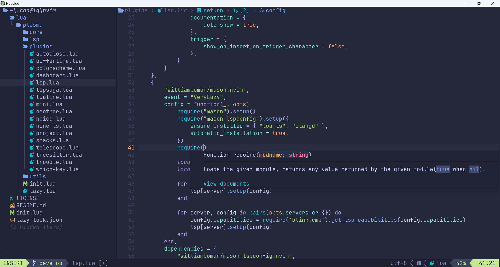

# Quick Start
## Pre-requisites
- [Neovim](https://neovim.io/)
- [Nerd Font](https://github.com/ryanoasis/nerd-fonts/releases/download/v3.3.0/JetBrainsMono.zip)
- [Rigrep](https://github.com/BurntSushi/ripgrep)
- [lazygit](https://github.com/jesseduffield/lazygit)
- [fzf](https://github.com/junegunn/fzf)
- [fd](https://github.com/sharkdp/fd)

## Install
> [!WARNING]
> Remember to back up your existing configuration

` $ git clone https://github.com/Jaffrez/Plasma.git ~/.config/nvim`

- Run Neovim and wait for lazy.nvim finishes downloading plugins.
- Enjoy!
